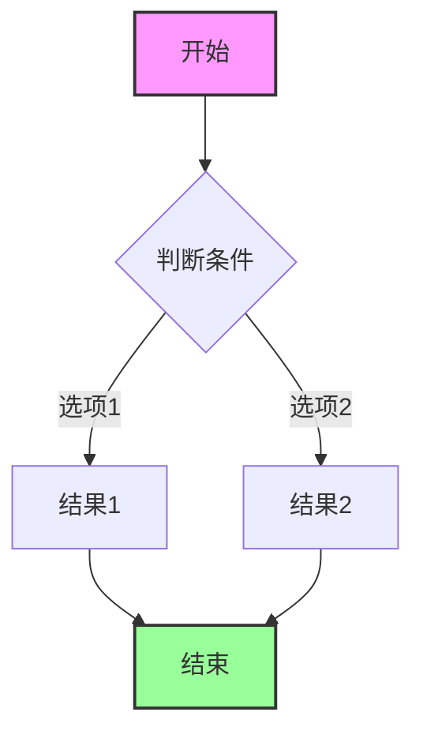
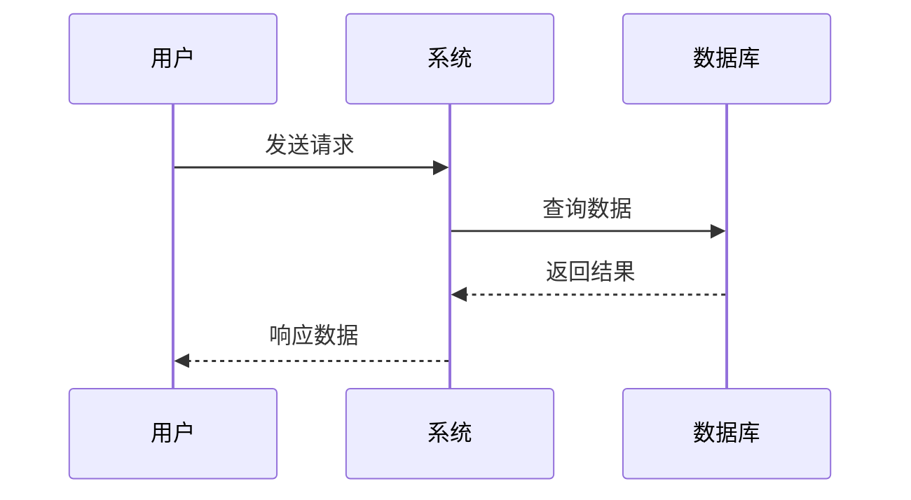

# Mermaid 图表测试

这是一个测试文档，用于验证 Mermaid 图表转 DOCX 功能。

## 流程图示例

## 时序图示例

## 文本内容

除了图表外，文档还包含普通文本内容，用于验证 Markdown 的基本转换功能。

- 列表项 1
- 列表项 2
- 列表项 3

## 数学公式测试

行内公式：$E = mc^2$

块级公式：
$$
\sum_{i=1}^n i = \frac{n(n+1)}{2}
$$

## 表格测试

| 列1 | 列2 | 列3 |
|-----|-----|-----|
| A   | B   | C   |
| D   | E   | F   |
