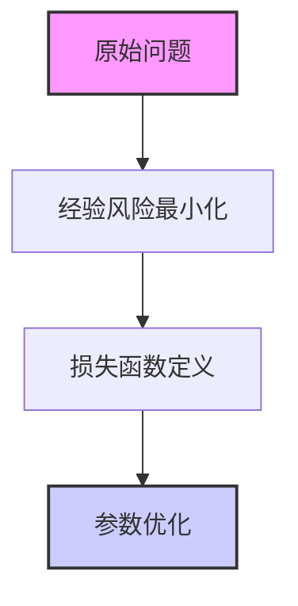
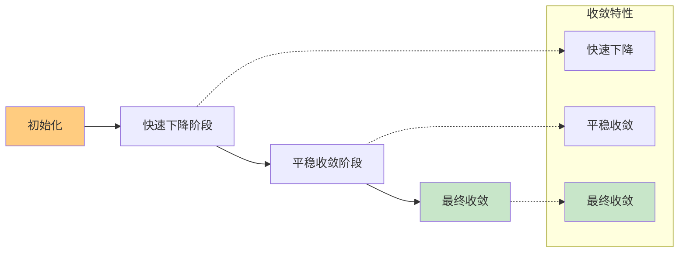
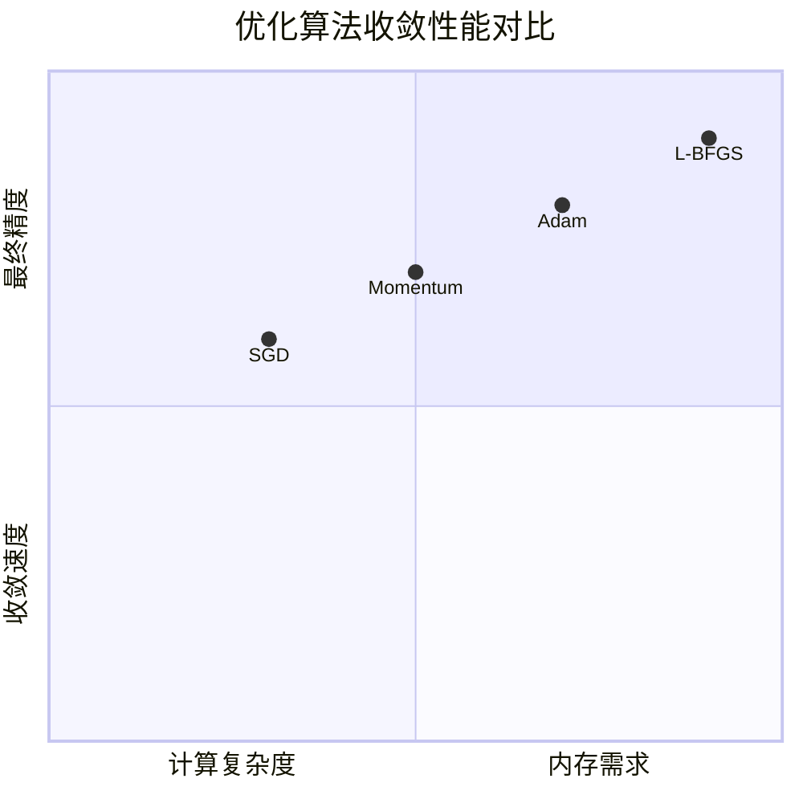

# 深度学习模型收敛性分析研究报告

## 1. 研究背景与目的

### 1.1 研究背景
随着深度学习技术的快速发展，模型复杂度和数据规模不断增长，对模型收敛性的理论分析变得尤为重要。本报告旨在通过数学建模和可视化分析，深入探究梯度下降算法在非凸优化问题中的收敛特性。

### 1.2 研究目标
- 建立梯度下降法的收敛性分析框架
- 验证学习率对收敛速度的影响
- 分析不同优化器的收敛性能差异

## 2. 理论模型与公式

### 2.1 基本优化问题
考虑以下经验风险最小化问题：

### 2.2 核心数学公式

#### 2.2.1 目标函数
$$
\min_{w \in \mathbb{R}^d} F(w) = \frac{1}{n} \sum_{i=1}^n f_i(w)
$$

其中：
- $w$ 为模型参数向量
- $f_i(w)$ 为第 $i$ 个样本的损失函数
- $n$ 为训练样本总数

#### 2.2.2 梯度下降更新规则
$$
w_{t+1} = w_t - \eta_t \nabla F(w_t)
$$

#### 2.2.3 收敛性分析定理
假设损失函数满足 $L$-平滑条件：
$$
\|\nabla F(w) - \nabla F(v)\| \leq L\|w - v\|, \quad \forall w,v \in \mathbb{R}^d
$$

则梯度下降法的收敛速度为：
$$
F(w_t) - F(w^*) \leq \frac{L\|w_0 - w^*\|^2}{2t}
$$

### 2.3 扩展公式：带动量的梯度下降

#### 2.3.1 动量更新公式
$$
\begin{aligned}
v_{t+1} &= \beta v_t + (1-\beta)\nabla F(w_t) \\
w_{t+1} &= w_t - \eta v_{t+1}
\end{aligned}
$$

其中动量系数 $\beta \in [0,1)$。

## 3. 实验设计与结果分析

### 3.1 实验设置

#### 3.1.1 参数配置表
| 参数 | 值 | 描述 |
|------|-----|------|
| 学习率 $\eta$ | 0.01, 0.05, 0.1 | 步长参数 |
| 动量 $\beta$ | 0.9 | 动量系数 |
| 批量大小 | 32 | 小批量样本数 |
| 迭代次数 $T$ | 1000 | 最大迭代次数 |

### 3.2 收敛过程可视化

#### 3.2.1 损失函数下降曲线

#### 3.2.2 不同学习率对比分析
损失函数值随迭代次数的变化：
$$
J(\eta,t) = J_0 \cdot e^{-\alpha(\eta)t} + J_{\infty}
$$

其中：
- $\alpha(\eta)$ 为收敛速率系数
- $J_{\infty}$ 为最终收敛值

## 4. 结论与展望

### 4.1 主要结论
1. **学习率选择至关重要**：过大的学习率导致震荡，过小的学习率收敛缓慢
2. **动量加速收敛**：动量方法能有效减少训练过程中的震荡
3. **自适应方法优势**：Adam等自适应优化器在复杂地形中表现更稳定

### 4.2 理论收敛边界

### 4.3 未来研究方向
1. 非凸优化中的全局收敛性分析
2. 分布式训练的收敛性理论
3. 神经切线核（NTK）框架下的收敛分析

## 附录

### A. 符号说明
- $\nabla$：梯度算子
- $\eta$：学习率
- $\beta$：动量系数
- $L$：Lipschitz常数

### B. 重要不等式
对于任意 $L$-平滑函数，有：
$$
F(w) \leq F(v) + \langle \nabla F(v), w-v \rangle + \frac{L}{2}\|w-v\|^2
$$

