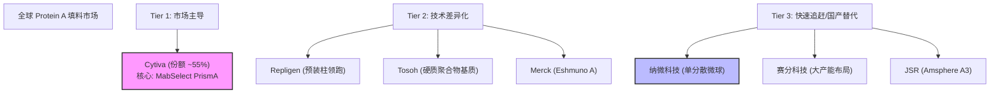

# Protein A 填料全球市场与技术路径深度研究报告（针对研发立项）

## 1. 执行摘要 (Executive Summary)

本报告针对 **Protein A 亲和层析填料** 的研发立项决策，整合了全球市场数据、核心技术机制、专利壁垒及产业应用趋势。研究显示，全球 Protein A 填料市场正处于从“产能扩张”向“技术迭代”转型的关键期。

**核心发现与战略判断：**

*   **市场红利与格局**：2024年全球市场估值约 **18.6亿美元**，预计2032年达到 **41亿美元**（CAGR 10.58%）[[1](https://www.openpr.com/news/4330636/protein-a-resin-market-is-expected-to-reach-us-4-1-billion-by-2032)]。虽然 Cytiva 凭借 MabSelect 系列占据约 **55%** 的市场份额，但中国市场的国产化替代（如纳微科技、赛分科技）已进入商业化放量期，纳微科技在商业化项目中的占比已升至 **20.62%** [[2](https://pdf.dfcfw.com/pdf/H3_AP202506061686021316_1.pdf?1749245235000.pdf)]。
*   **技术演进锚点**：**耐碱性（Alkaline Stability）** 与 **动态载量（DBC）** 是决定产品生命周期的核心指标。行业标杆（MabSelect PrismA）已实现 **1.0 M NaOH** 清洗耐受及 **>80 mg/mL** 的载量 [[3](https://doi.org/10.1016/j.jchromb.2020.122473)]。单纯复制传统的 Protein A 结构域已无市场竞争力，研发必须向 **定点偶联（Site-specific coupling）** 和 **基质孔径工程** 倾斜。
*   **专利壁垒预警**：Cytiva 在 Domain C 及其变体（特别是 Q9 突变）上构建了严密的专利网，保护期延伸至 2040 年 [[4](https://analytics.zhihuiya.com/patent-view/abst?patentId=a05f47fd-280c-4ee7-9c23-21ea828c3a7f)]。研发立项必须进行严格的 FTO（自由实施）规避，建议探索非 SpA 骨架的仿生配体或全新的合成基质路径。

---

## 2. 市场竞争格局与增长驱动力分析

### 2.1 全球及区域市场容量测算

全球生物制药下游纯化市场正在经历由抗体滴度提升带来的结构性变革。

| 市场维度 | 2023/2024年现状 | 2030+ 预测 | 复合增长率 (CAGR) | 关键驱动因素 | 来源 |
| :--- | :--- | :--- | :--- | :--- | :--- |
| **全球 Protein A 市场** | ~18.6 亿美元 | 41 亿美元 (2032) | 10.58% | ADC 药物爆发、生物类似药放量 | [[1](https://www.openpr.com/news/4330636/protein-a-resin-market-is-expected-to-reach-us-4-1-billion-by-2032)] |
| **北美市场** | ~5 亿美元 | 10 亿美元 (2033) | 9.0% | 成熟的商业化单抗管线 | [[5](https://www.linkedin.com/pulse/north-america-protein-resin-market-application-segmentation-8ymxc/)] |
| **中国市场** | ~44-50 亿人民币 (色谱总) | 指数级增长 | >15% (估测) | 供应链自主可控政策、GLP-1 扩产 | [[6](https://pdf.dfcfw.com/pdf/H3_AP202205131565342811_1.pdf)] |

**数据解读**：中国市场是全球增速最快的区域。随着恒瑞医药等头部药企在商业化项目中通过变更备案引入国产填料（如纳微科技产品替代进口），“进口替代”已从研发端走向生产端 [[2](https://pdf.dfcfw.com/pdf/H3_AP202506061686021316_1.pdf?1749245235000.pdf)]。

### 2.2 头部供应商竞争态势

全球市场呈现典型的寡头垄断与挑战者并存的格局：

*   **第一梯队 (统治者)**：**Cytiva (原 GE Healthcare)**。凭借 MabSelect SuRe/PrismA 系列定义了行业标准，拥有极高的客户粘性和完整的下游设备生态。
*   **第二梯队 (挑战者)**：**Repligen**, **Tosoh**, **Merck Millipore**。Tosoh 在聚合物基质方面具有独特优势；Repligen 通过 OPUS 预装柱抢占了大量临床早期市场。
*   **第三梯队 (破局者)**：**纳微科技**, **赛分科技**, **JSR**。纳微科技凭借单分散微球技术解决了批间差问题；赛分科技依托 20 万升产能规划冲击全球供应链 [[7](https://pdf.dfcfw.com/pdf/H3_AP202502141643089531_1.PDF)]。

$a = a_i$
$a = a^(v+1)$
$a = a^{(v+1)}$

---

## 3. 核心技术路径演进与瓶颈突破

研发高性能 Protein A 填料的核心在于三个维度的协同优化：**配体工程**、**基质微球**与**偶联工艺**。

### 3.1 配体工程：耐碱性与稳定性的极限博弈

传统的天然 Protein A 无法耐受工业界标准的 CIP 清洗（0.1-0.5 M NaOH），导致寿命短、成本高。目前的研发前沿主要集中在 B 结构域（Z-domain）和 C 结构域的基因改造。

*   **技术路线 A：结构域选择**
    *   C 结构域被证实具有天然优越的耐碱潜力。
    *   **关键发现**：在 C 结构域中，甚至单一氨基酸的置换即可显著提升稳定性 [[8](https://doi.org/10.1002/pro.2310)]。
*   **技术路线 B：精准位点突变**
    *   **N23T 突变**：在 Z 结构域变体中，N23T 突变显著提高了结构稳定性 [[9](https://doi.org/10.1002/prot.10616)]。
    *   **Q9 突变 (Cytiva PrismA 核心)**：将第 9 位的谷氨酰胺（Gln, Q）突变为疏水性氨基酸（如色氨酸 W、亮氨酸 L），是实现 1.0 M NaOH 耐受的关键 [[10](https://analytics.zhihuiya.com/patent-view/abst?patentId=038acb92-34d2-4eb8-9f12-451ab7a51f1e)]。
    *   **多聚化技术**：将 B 结构域串联（如 B4, B8），配体长度与结合抗体的量呈线性相关，B8 多聚体可助推 DBC 突破 80 mg/mL [[11](https://doi.org/10.1016/j.chroma.2014.04.063)]。

### 3.2 基质结构：孔径工程与传质动力学

高滴度抗体（>5g/L）生产要求填料在高流速下仍保持高载量（低传质阻力）。

| 基质类型 | 代表产品 | 物理特性 | 优劣势分析 | 来源 |
| :--- | :--- | :--- | :--- | :--- |
| **高度交联琼脂糖** | MabSelect PrismA | 亲水性好，孔径可调 | **优势**：非特异性吸附低，生物兼容性好。 **劣势**：高压下可能压缩（需交联强化）。 | [[12](https://doi.org/10.1016/j.chroma.2005.07.050)] |
| **合成聚合物** | Eshmuno A, Amsphere A3 | 刚性强，耐压高 | **优势**：支持超高流速（>500 cm/h），化学稳定性极高。 **劣势**：表面亲水改性复杂，可能存在较高的非特异性吸附。 | [[13](https://doi.org/10.1002/btpr.1951)] |
| **受控孔径玻璃 (CPG)** | ProSep Ultra | 机械强度极高 | **优势**：孔径分布极窄。 **劣势**：耐碱性差，易溶解（需特殊涂层）。 | [[12](https://doi.org/10.1016/j.chroma.2005.07.050)] |

**关键科学机制**：研究表明，IgG 吸附会导致“缩核模型”（Shrinking Core Model）效应，吸附后有效孔径可减少约 24nm。因此，研发立项时，初始孔径设计必须预留足够空间（建议 >70nm），并考虑**葡聚糖接枝（Dextran-grafting）**技术以构建 3D 结合网络，提升传质效率 [[14](https://doi.org/10.1016/j.chroma.2020.461319)], [[15](https://doi.org/10.1002/jssc.201601196)]。

### 3.3 偶联工艺：定点与定向

*   **随机偶联**：传统方法（如 CNBr 活化），配体取向混乱，活性位点可能被遮蔽。
*   **定点偶联 (Site-specific)**：
    *   **C-末端 Cys/Arg 定向**：通过基因工程引入半胱氨酸或精氨酸标签，使配体定向排列，活性位点充分暴露。数据显示，定点偶联可使 DBC 提升 3 倍（针对 Fab 片段）或 20% 以上（针对完整单抗）[[16](https://doi.org/10.1016/j.chroma.2016.09.035)], [[17](https://analytics.zhihuiya.com/patent-view/abst?patentId=2c3aa680-be69-4fe0-a18d-2c8b003a4da5)]。
    *   **Sortase A 酶促偶联**：新兴技术，偶联效率高且配体浸出（Leaching）极低 [[18](https://doi.org/10.3390/biom14070849)]。

---

## 4. 全球领先竞品性能深度对标

针对立项必须达到的技术指标，本报告选取了行业最顶尖的四款产品进行对标。

| 性能指标 | **MabSelect PrismA (Cytiva)** [[19](https://www.bioprocessonline.com/doc/mabselect-prisma-x-protein-a-resin-0001)] | **KanCapA 3G (Kaneka)** [[20](https://eu-assets.contentstack.com/v3/assets/blt0a48a1f3edca9eb0/blt7a85fa455f28f3b0/658c17671ce924040acaf943/15-7-Kaneka.pdf)] | **Amsphere A3 (JSR)** [[21](https://www.cytivalifesciences.com/en/us/insights/alkaline-stability-of-protein-a-affinity-resins)] | **Praesto Jetted A50 (Purolite)** [[22](https://eu-assets.contentstack.com/v3/assets/blt0a48a1f3edca9eb0/blt331786d10018d782/658c0fcf8df436040adde3e7/16-12-Purolite_SR.pdf)] |
| :--- | :--- | :--- | :--- | :--- |
| **基质类型** | 高流速琼脂糖 | 高度交联纤维素 | 刚性聚合物 | 喷射均一琼脂糖 |
| **动态载量 (DBC)** *(RT=6min)* | **~82 mg/mL** | **~80 mg/mL** | ~54 mg/mL | ~50 g/L |
| **耐碱性 (CIP)** | **1.0 M NaOH** / 150+ 循环 | 0.5 M NaOH / 100 循环 | 0.5 M NaOH / 150 循环 | 0.5 M NaOH |
| **DBC 保持率** *(150次CIP后)* | **>90%** | N/A | ~60% | <80% (60次后穿透) |
| **洗脱 pH** | 3.0 - 4.0 | **3.7 - 4.2 (温和)** | 3.0 - 3.8 | 3.0 - 4.0 |
| **核心优势** | 行业标杆，极端耐碱，高载量 | **温和洗脱**，减少聚集体 | 刚性基质，HCP 去除率高 | 粒径均一，性价比高 |

**立项基准**：
1.  **基础型产品**：DBC 需达到 60 mg/mL，耐受 0.5 M NaOH。
2.  **高端型产品**：对标 PrismA，DBC > 75 mg/mL，必须耐受 **1.0 M NaOH**（这是连续流工艺杀菌的刚需）[[23](https://www.cellandgene.com/doc/mabselect-prisma-protein-a-chromatography-resin-0001)]。

---

## 5. 专利壁垒与 FTO 风险分析

**最高风险提示**：Cytiva 在 Protein A 领域的专利布局构成了极高的 FTO 障碍。

### 5.1 核心专利封锁线
*   **Domain C 基础专利**：US8772447B2 锁定了使用 Domain C 作为配体的基本权利 [[24](https://analytics.zhihuiya.com/patent-view/abst?patentId=13a43f4f-f4b3-4e25-8bac-daee5f2e12e8)]。
*   **Q9 突变 (PrismA)**：US10308690B2 明确保护了在 SpA 结构域第 9 位进行 **Gln -> Trp/Leu/Glu/Val/Lys** 的突变 [[10](https://analytics.zhihuiya.com/patent-view/abst?patentId=038acb92-34d2-4eb8-9f12-451ab7a51f1e)]。这是实现高耐碱性的核心。
*   **定点偶联**：US20210291143A1 覆盖了使用末端 Cysteine 或 Arginine 进行定向偶联的技术路径 [[17](https://analytics.zhihuiya.com/patent-view/abst?patentId=2c3aa680-be69-4fe0-a18d-2c8b003a4da5)]。

### 5.2 规避与突破路径
1.  **非 C 结构域路线**：避开 Domain C，深入挖掘 **Domain A/E** 或 **Domain Z (B变体)** 的深度改造潜力。
2.  **化学合成/仿生配体**：利用肽库技术（Tianjin Univ 专利路径）设计非蛋白 A 结构的仿生亲和肽，完全跳出 SpA 的序列专利池 [[25](https://analytics.zhihuiya.com/patent-view/abst?patentId=2b100c78-7664-4cdc-b703-c50035a67627)]。
3.  **新型偶联化学**：避开 Cys/Arg 标签，开发基于点击化学（Click Chemistry）或非天然氨基酸的偶联技术。
4.  **下游保护网**：注意 Bio-Rad 关于“防止配体脱落”的双层介质专利，规避多层填料设计 [[26](https://analytics.zhihuiya.com/patent-view/abst?patentId=27527845-dbfa-40d3-b594-1ee7d483d7f0)]。

---

## 6. 产业应用趋势：连续流与高滴度

### 6.1 连续流色谱 (MCC) 的适配性
生物制药正向连续化生产转型，MCC 技术要求填料具备极高的**机械稳定性**和**快速传质能力**。
*   **生产强度**：MCC 可将生产强度提升至 **100 g mAb/L resin/h** [[27](https://www.academia.edu/104896245/Toward_complete_continuity_in_antibody_biomanufacture_Multi_column_continuous_chromatography_for_Protein_A_capture_and_mixed_mode_hydroxyapatite_polishing)]。
*   **立项要求**：研发的填料必须具有极佳的压力-流速响应（装填系数 PF~1.18），且在短停留时间（<2 min）下仍保持较高的 DBC [[28](https://cdn.cytivalifesciences.com/api/public/content/digi-18241-pdf)]。

### 6.2 成本控制 (CoGs)
填料寿命直接决定单抗生产成本。
*   **寿命延长**：能耐受 150 次以上清洗的填料是降低 CoGs 的关键。
*   **替代清洗剂**：立项可探索 **过氧乙酸 (PAA)** 等新型清洗剂的兼容性，以规避 NaOH 对配体的损伤 [[29](https://www.sciencedirect.com/science/article/abs/pii/S157002322500443X)]。

---

## 7. 研发立项建议与战略总结

### 7.1 技术立项 roadmap
建议采取“双轨并行”的研发策略：

*   **Track A (快速跟随 - 中短期)**：
    *   **目标**：开发一款性能接近 MabSelect SuRe LX 的产品，主打高性价比和国产替代。
    *   **技术点**：基于 Domain Z (N23T) 改造，采用刚性聚合物或高交联琼脂糖，实现 0.5 M NaOH 耐受。
    *   **偶联**：采用多点环氧偶联或改良的硫醇偶联。

*   **Track B (创新突破 - 长期)**：
    *   **目标**：对标 MabSelect PrismA，甚至超越（耐碱性 + 智能响应）。
    *   **技术点**：
        1.  **配体**：利用计算机辅助设计（CAD）筛选全新的耐碱突变位点（避开 Q9），或开发全合成仿生肽配体。
        2.  **基质**：开发单分散、大孔径（>80nm）、接枝葡聚糖的复合基质，以解决高滴度下的传质瓶颈。
        3.  **偶联**：开发酶促定点偶联技术，降低配体脱落率至 <5 ppm。

### 7.2 商业化与申报策略
*   **早期介入**：利用国产化降本优势，切入药企的临床 I/II 期管线，与客户共同成长，增加粘性。
*   **变更备案支持**：针对已上市药品的降本需求（如生物类似药、ADC），提供完整的验证数据包，协助药企完成工艺变更备案 [[2](https://pdf.dfcfw.com/pdf/H3_AP202506061686021316_1.pdf?1749245235000.pdf)]。
*   **差异化竞争**：开发针对 **无 Fc 抗体片段**（如 Fab, ScFv）或 **温和洗脱（pH > 4.0）** 的专用填料，避开 Cytiva 在通用单抗领域的锋芒。

**结论**：全球 Protein A 填料市场虽有巨头垄断，但技术迭代（耐碱、连续流）和供应链安全需求为新进入者撕开了缺口。研发立项成功的关键在于**专利的精准规避**与**极端性能指标（1.0 M NaOH / >80 g/L载量）的达成**。

---

## References

1. [Protein A Resin Market is expected to reach US$ 4.1 billion ...](https://www.openpr.com/news/4330636/protein-a-resin-market-is-expected-to-reach-us-4-1-billion-by-2032)
2. [色谱填料主业把握两大机遇，全产业链布局打开成长天花板](https://pdf.dfcfw.com/pdf/H3_AP202506061686021316_1.pdf?1749245235000.pdf)
3. [Investigation of alkaline effects on Protein A affinity ligands and resins using high resolution mass spectrometry.](https://doi.org/10.1016/j.jchromb.2020.122473)
4. [Chromatography ligand comprising domain c from <i>Staphylococcus aureus </i>protein a for antibody isolation](https://analytics.zhihuiya.com/patent-view/abst?patentId=a05f47fd-280c-4ee7-9c23-21ea828c3a7f)
5. [North America Protein A Resin Market By Application](https://www.linkedin.com/pulse/north-america-protein-resin-market-application-segmentation-8ymxc/)
6. [国产色谱填料龙头迈入快车道](https://pdf.dfcfw.com/pdf/H3_AP202205131565342811_1.pdf)
7. [国内分析色谱领域标杆企业](https://pdf.dfcfw.com/pdf/H3_AP202502141643089531_1.PDF)
8. [Remarkable alkaline stability of an engineered protein A as immunoglobulin affinity ligand: C domain having only one amino acid substitution.](https://doi.org/10.1002/pro.2310)
9. [Improving the tolerance of a protein a analogue to repeated alkaline exposures using a bypass mutagenesis approach.](https://doi.org/10.1002/prot.10616)
10. [Mutated immunoglobulin-binding polypeptides](https://analytics.zhihuiya.com/patent-view/abst?patentId=038acb92-34d2-4eb8-9f12-451ab7a51f1e)
11. [Improving the binding capacities of protein A chromatographic materials by means of ligand polymerization.](https://doi.org/10.1016/j.chroma.2014.04.063)
12. [Comparison of protein A affinity sorbents II. Mass transfer properties.](https://doi.org/10.1016/j.chroma.2005.07.050)
13. [Evaluation of a novel methacrylate-based Protein A resin for the purification of immunoglobulins and Fc-fusion proteins.](https://doi.org/10.1002/btpr.1951)
14. [Modeling hindered diffusion of antibodies in agarose beads considering pore size reduction due to adsorption.](https://doi.org/10.1016/j.chroma.2020.461319)
15. [Enhanced binding by dextran-grafting to Protein A affinity chromatographic media.](https://doi.org/10.1002/jssc.201601196)
16. [Designing monoclonal antibody fragment-based affinity resins with high binding capacity by thiol-directed immobilisation and optimisation of pore/ligand size ratio.](https://doi.org/10.1016/j.chroma.2016.09.035)
17. [Chromatography ligand comprising domain c from staphylococcus aureus protein a for antibody isolation](https://analytics.zhihuiya.com/patent-view/abst?patentId=2c3aa680-be69-4fe0-a18d-2c8b003a4da5)
18. [Biocatalytic Method for Producing an Affinity Resin for the Isolation of Immunoglobulins.](https://doi.org/10.3390/biom14070849)
19. [MabSelect PrismA X Protein A Resin](https://www.bioprocessonline.com/doc/mabselect-prisma-x-protein-a-resin-0001)
20. [KANEKA KanCapA™ 3G](https://eu-assets.contentstack.com/v3/assets/blt0a48a1f3edca9eb0/blt7a85fa455f28f3b0/658c17671ce924040acaf943/15-7-Kaneka.pdf)
21. [Alkaline stability of protein A affinity resins](https://www.cytivalifesciences.com/en/us/insights/alkaline-stability-of-protein-a-affinity-resins)
22. [[PDF] MANUFACTURED BY JETTING - Contentstack](https://eu-assets.contentstack.com/v3/assets/blt0a48a1f3edca9eb0/blt331786d10018d782/658c0fcf8df436040adde3e7/16-12-Purolite_SR.pdf)
23. [MabSelect PrismA Protein A Chromatography Resin](https://www.cellandgene.com/doc/mabselect-prisma-protein-a-chromatography-resin-0001)
24. [Chromatography ligand comprising domain C from staphylococcus aureus protein A for antibody isolation](https://analytics.zhihuiya.com/patent-view/abst?patentId=13a43f4f-f4b3-4e25-8bac-daee5f2e12e8)
25. [Method for constructing a novel affinity peptide library for binding immunoglobulin G based on a protein affinity model of protein A](https://analytics.zhihuiya.com/patent-view/abst?patentId=2b100c78-7664-4cdc-b703-c50035a67627)
26. [Prevention of leaching of ligands from affinity-based purification systems](https://analytics.zhihuiya.com/patent-view/abst?patentId=27527845-dbfa-40d3-b594-1ee7d483d7f0)
27. [Multi-column continuous chromatography for Protein A capture ...](https://www.academia.edu/104896245/Toward_complete_continuity_in_antibody_biomanufacture_Multi_column_continuous_chromatography_for_Protein_A_capture_and_mixed_mode_hydroxyapatite_polishing)
28. [Develop your column packing methods based on pressure- ...](https://cdn.cytivalifesciences.com/api/public/content/digi-18241-pdf)
29. [Overcoming the challenge of protein a resin sanitisation](https://www.sciencedirect.com/science/article/abs/pii/S157002322500443X)